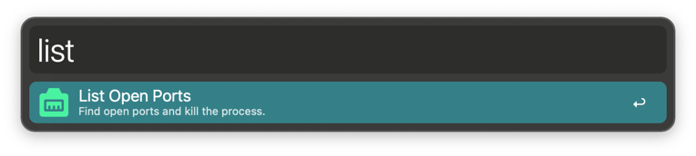
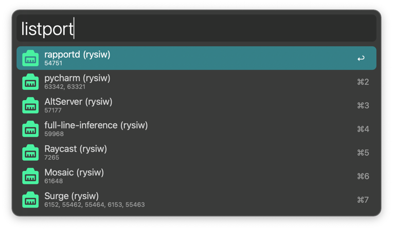

#  Alfred List Open Ports Workflow

This Alfred workflow can easily show the open listening ports and kill the processes which open them.

## Install

Go to [Latest Release](https://github.com/Rysiwv/alfred-list-open-ports-workflow/releases/latest) download `ListOpenPorts.alfredworkflow` and double-click it.

## Usage

  In Alfred, type `listport`, <kbd>⏎</kbd>
- press <kbd>⏎</kbd> to copy process name.
- press <kbd>⌘</kbd> + <kbd>⏎</kbd> to kill the process.

## Credits

### Modules

- [alfred-pyworkflow](https://github.com/harrtho/alfred-pyworkflow)
